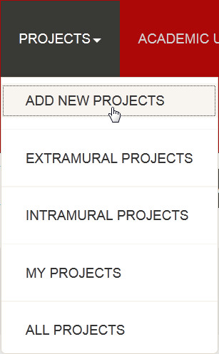
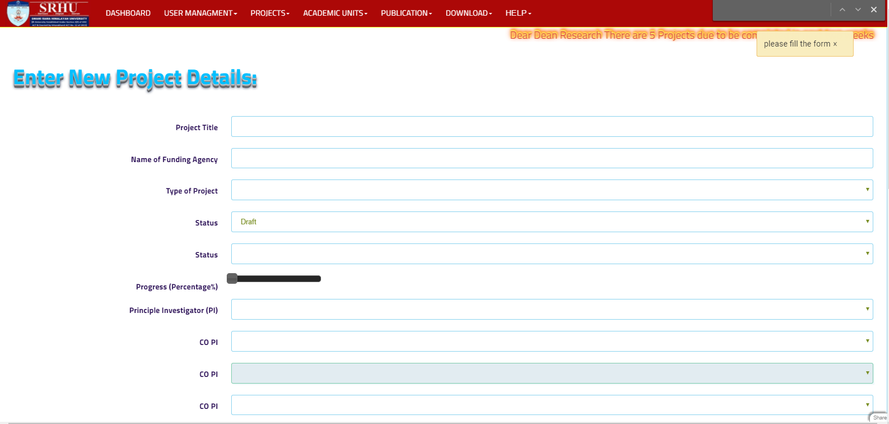
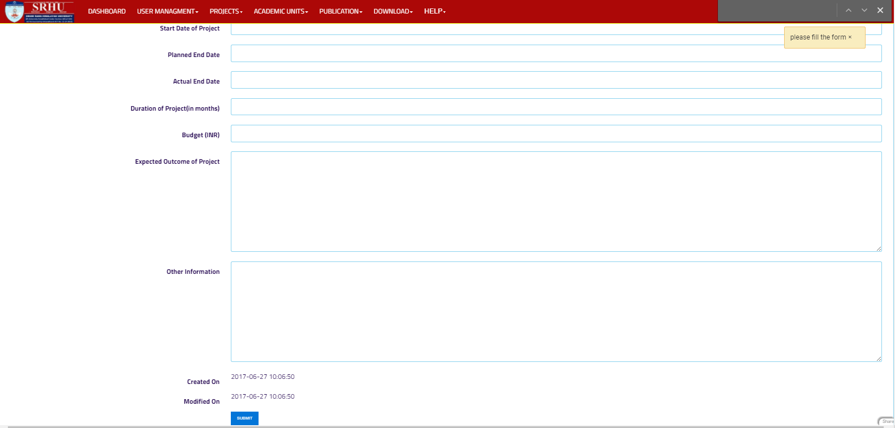
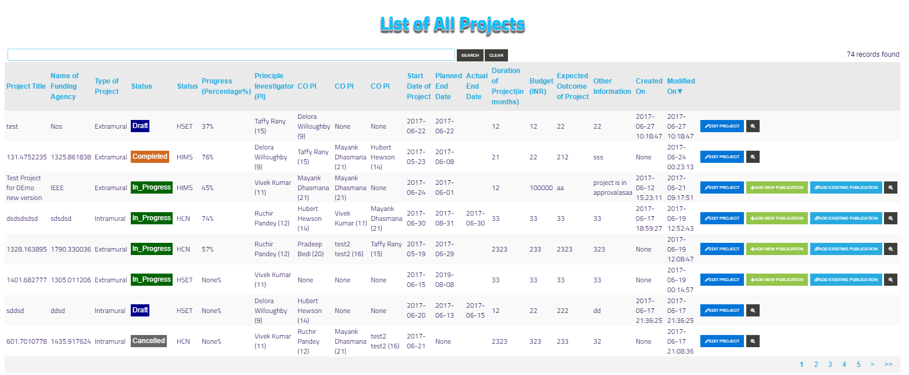

Add New Project
===============

**The following steps are describe how to create new Project**

**step 1. - Then click on the PROJECTS at the header of application, the drop down menu will open and you have to click on ADD NEW PROJECTS**

**step 2. - The Add new projects form will open**

**step 3. - press the submit button to create new project**

**step 4. - after submit, you will be redirected to list of project and new project will appear on top**

