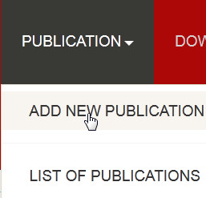
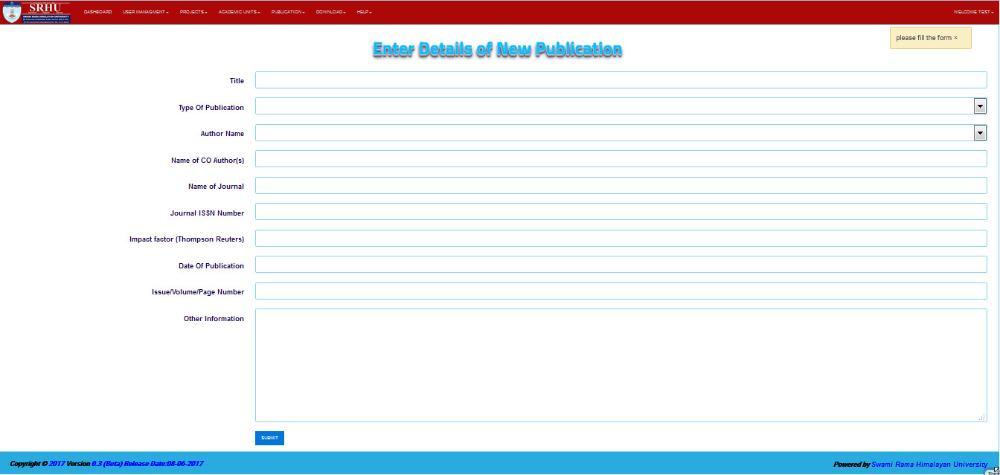
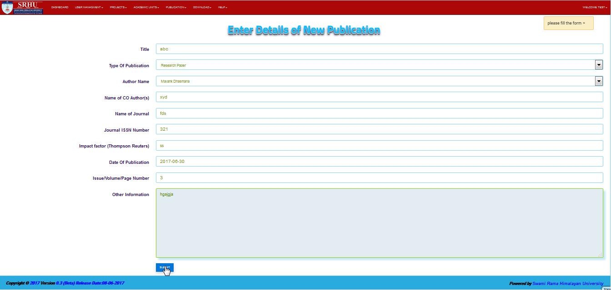

Add New Publication
===================

**step 1- Then click on the PUBLICATION at the header of application, the drop down menu will open and you have to click on ADD NEW PUBLICATION**

**step 2- The Add New Publication form will open**

**step 3- So now fill all the field which shown in the form and then click on the submit button**

**step 4- Finally, The new user will created**
											
                                            
                                            
                                            