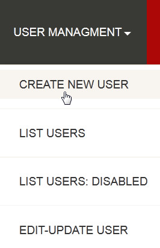
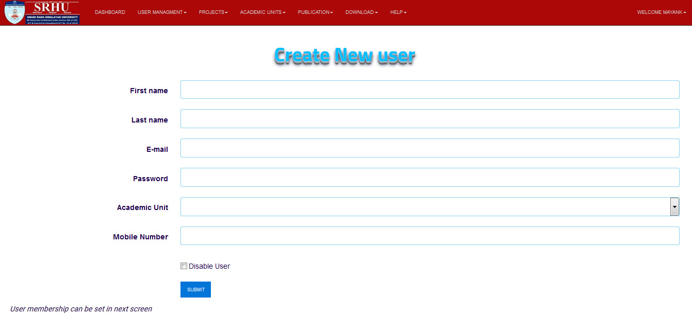
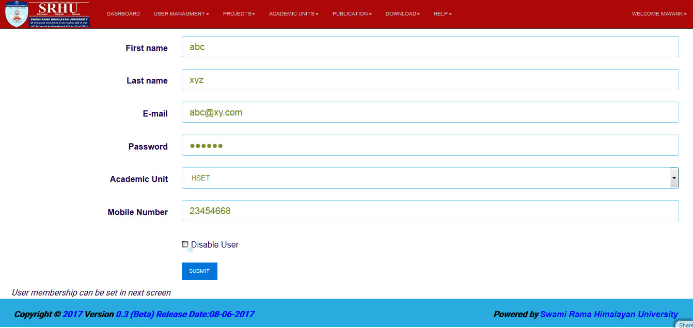

Create New User
===============

**The following steps are describe how to create new user**

**step 1. - Open the application and logged in**

**step 2. - Dashboard will open**

.. image:: screenshot/Admin_Dashboard.JPG

**step 3. - Then click on the USER MANAGEMENT at the header of application, the drop down menu will open and you have to click on CREATE NEW USER**

**step 4. - The registration form will open**

**step 5. - So now fill all the field which shown in the form and then click on the submit button**

.. note:: **Disable user switch can be used to disable user**
If a new user is being created that is yet to join SRHU then new user should be created as disabled, it can be unchecked later on in Edit user screen

**step 6. - New user will be created**
next importamnt step is to assign the membership, user can either be *faculty* or *admin* type.
every user should have either of the membership.

**step 7. - Assign membership**
Assign membership by clicking on **+Add Record** button.

.. image:: create_user_pic/add_membership.jpg
