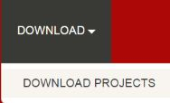
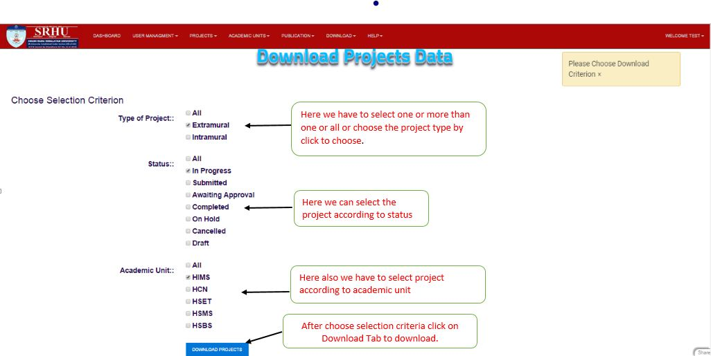
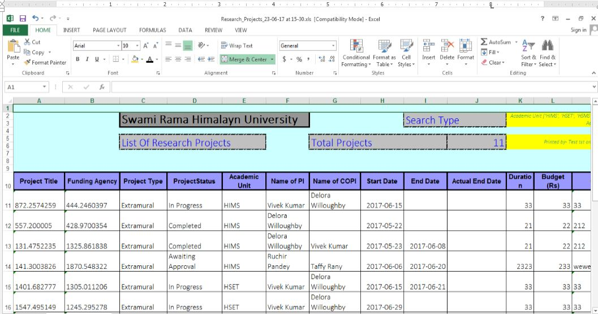

Download Projects
=================

**step 1. - click on the DOWNLOAD at the header of application, the drop down menu will open and you have to click on DOWNLOAD PROJECTS**

**step 2. - So Download page will displayed in which type of project, status and acadmic unit are listed with checkboxes**

**Step 3 - Now select the project and download excel file to click on download project button**

