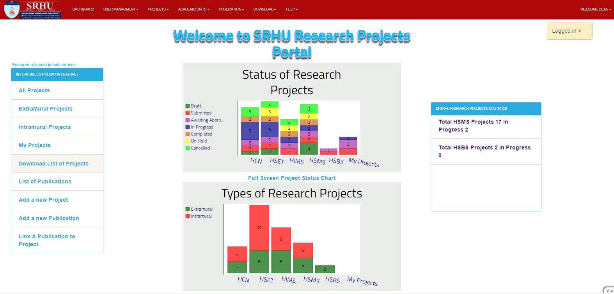

Extramural Projects
===================

**The following steps describe how to open Extramural Project list**

**step 1. - Open the application and logged in**

**step 2. - Dashboard will open**

**step 3. - Then click on the PROJECTS Link at the header of application, the drop down menu will open and you have to click on Extramural Project**

**step 4. - So List of Extramural Project will displayed**

.. note:: **you can directoly search a specific user by using search bar**

            .. image:: Extramural_pics/search_extramural.jpg
            
            
**Projects can be edited and publication can be added/removed from projets using buttons on right, Refer to Edit project for detailed information   Project list. These are-**

