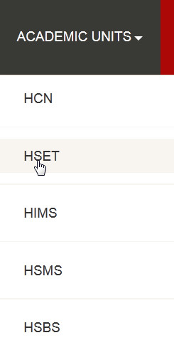
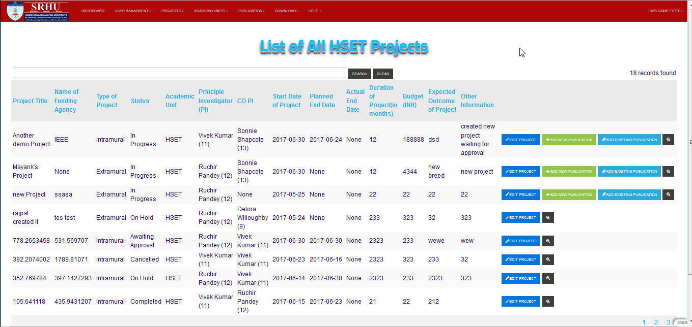

Himalayan School Of Engineering and Technology
==============================================

**step 1. - Click on the ACADMIC_UNIT Link at the header of application, the drop down menu will open and you have to click on HSET**

**step 2. - So List of Himalayan School Of Engineering and Technology(HSET) will displayed**

.. note:: **you can directoly search a specific user by using search bar**

            .. image:: Extramural_pics/search_extramural.jpg
            
            
**There are some more operation are perform in the Himalayan School Of Engineering and Technology(HSET) list. These are-**

.. note:: **you can directoly Add/Remove/Edit by clicking on the following buttons**

            .. image:: Extramural_pics/all_button.jpg
            
           **EDIT PROJECT Button :**
           
            This button is used to edit projects details
            
            .. image:: Extramural_pics/edit_button.jpg
            
            
           **ADD NEW PUBLICATION Button :**
           
            This button is used to add new publication
            
            .. image:: Extramural_pics/editnewpublication_button.jpg
            
            
           **ADD EXISTING PUBLICATION Button :**
           
            This button is used to add existing publication
            
            .. image:: Extramural_pics/addexistpublication_button.jpg
            
            
           **VIEW Button :**
           
            This button is used to view details of a perticular project
            
            .. image:: Extramural_pics/view_button.jpg