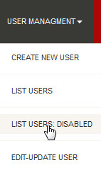
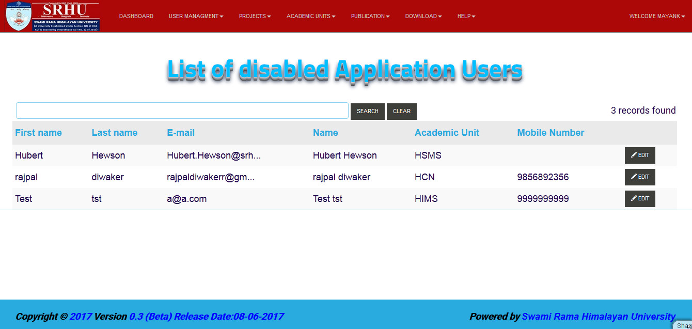

List Users Disabled
===================

**In this mode we can see the screen of Disabled Users or we can search by name of user.**

**we can use the following steps to open the list of all disabled users**

**step 1. - Open the application and logged in**

**step 2. - Dashboard will open**

.. image:: screenshot/Admin_Dashboard.JPG

**step 3. - Then click on the USER MANAGEMENT at the header of application, the drop down menu will open and you have to click on LIST USER: DISABLE**

**step 4. - So List of all disable user will displayed**

.. note:: **you can directoly search a specific user by using search bar**

            .. image:: create_user_pic/searchbar.jpg