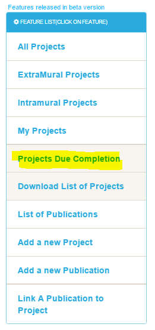

Projects Due Completion
=======================

The research project that are due completion in next two week are flagged in portal. 
.. role:: bluetext

.. warning::
   Any research project, which is of status :bluetext:`*"in Progress"*`, has completion date in next 2 week,It is highlighted in portal.

**The list of projects that are due completion in next 2 weeks can be accessed in various ways :**

How to Open
-----------
*Clicking on Dashboard left panel:*

*Clicking on Top Menu Bar:*

List of Projects Due Completion
-------------------------------
On clicking on any of the above link, a list of projects is opened that are due completion in next 2 weeks

Warning and Notification
------------------------

If any of user project, which is of status "in Progress", is due completion in next 2 week, a floating warning bar starts appearing below top menu bar.
This flashing text keep appearing until there are no "in progress" projects due completion in next 2 weeks. This includes the projects that have passed 
completion date.

