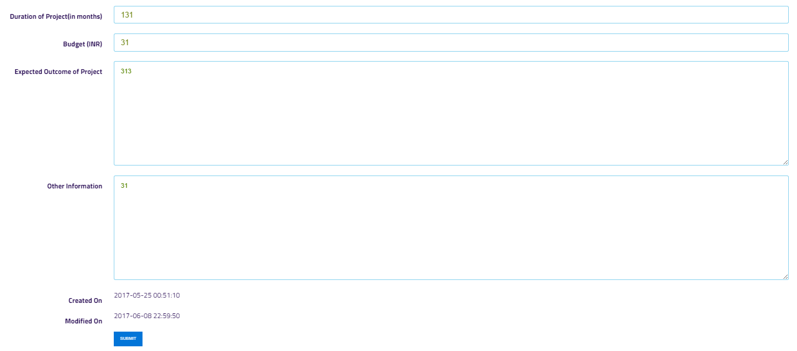
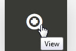

Edit project
============

.. note:: **you can directly MANAGE project by clicking on the following buttons**

            .. image:: Extramural_pics/all_button.jpg
            
.. note:: **EDIT PROJECT:**
           
            This button is used to edit projects details
            

.. note:: on clicking edit button following screen will open

.. image:: Project_Pics/Edit_Project-1.PNG

         
            
.. note:: **ADD NEW PUBLICATION:**
           
            This button is used to add new publication
            

            
            
.. note:: **LINK EXISTING PUBLICATION :**
           
            This button is used to add existing publication
            

            
            
.. note:: **VIEW PROJECT DETAILS :**
           
            This button is used to view details of a perticular project
            
