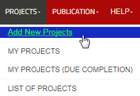
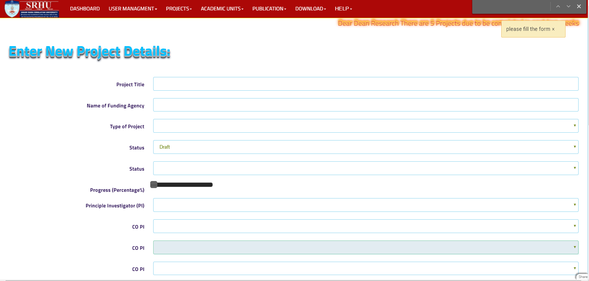
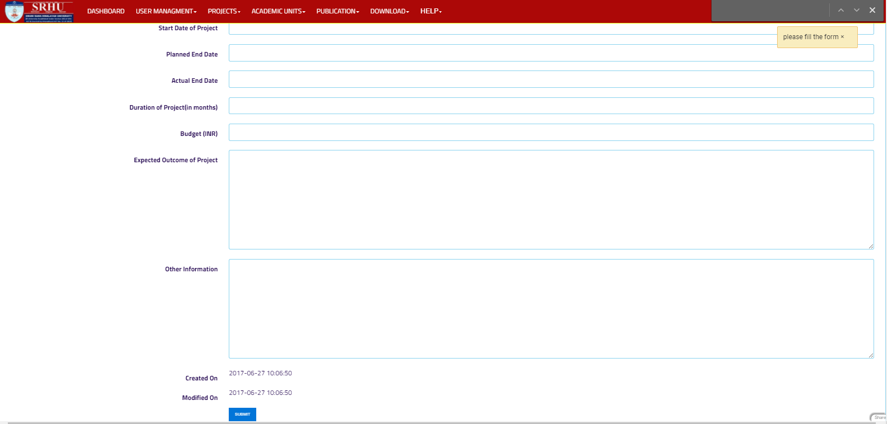
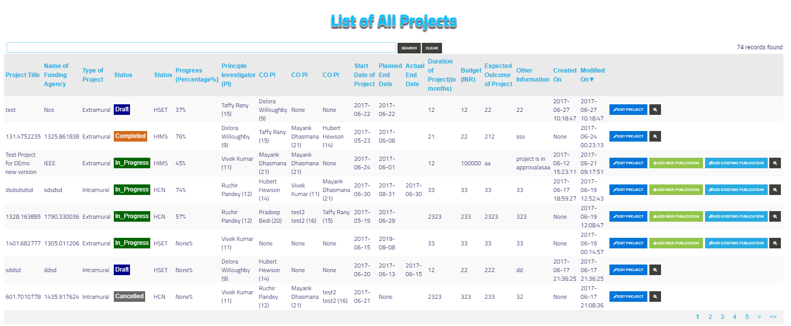

Add New Project
===============

**The following steps are describe how to create new Project**

**Step 1. - Click on the PROJECTS at the header of application, the drop down menu will open and then click on ADD NEW PROJECTS**

**Step 2. - The Add new projects form will open**

**Step 3. - Press the submit button to create new project**

**Step 4. - After submit, you will be redirected to list of project and new project will appear on top**

