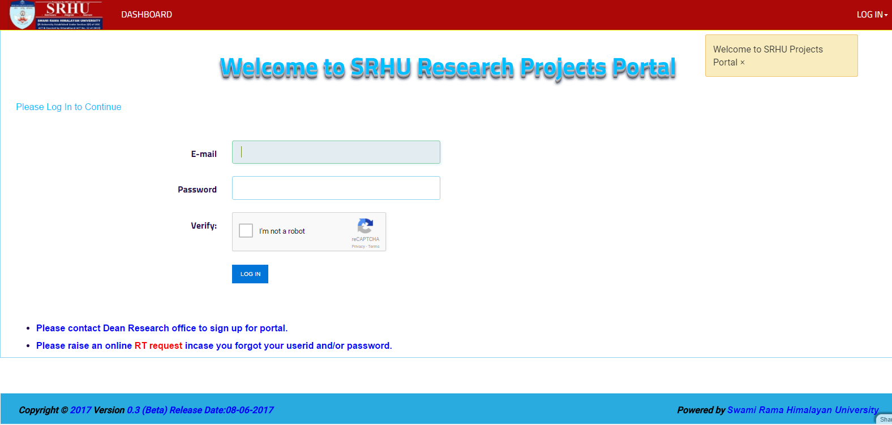

Logon Screen
============

User must login using his SRHU official email id and password. 

Depending upon user type user viz. faculty or admin, user lands on dashboard with specific options. 

These options are described in detail in further sections 

Environments
------------

Application is hosted in three environments - 

Production : http://apps.srhu.edu.in

Test       : http://apps.srhu.edu.in:83

Development: http://apps.srhu.edu.in:81

Normal faculty users are only granted logon credentials in **production** environment

**Test** environment is used for user accpetance testing

**Developement** Environemnt is used for IT team for developing application.

Learn more
----------

* :doc:`Admin User </Dashboard/Admin_home_page>`
* :doc:`Faculty User </Dashboard/User_home_page>`